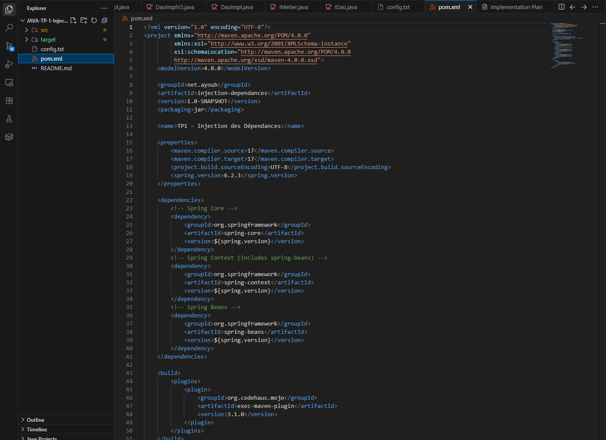
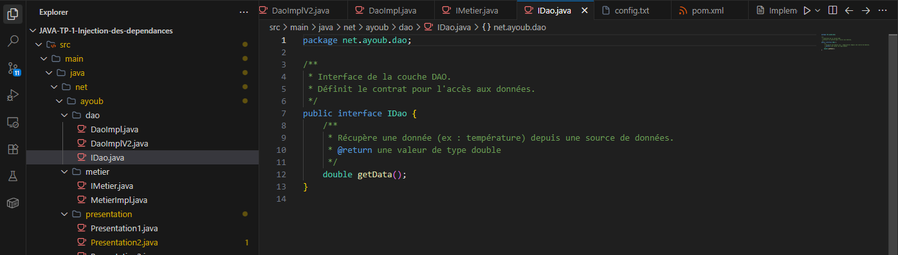
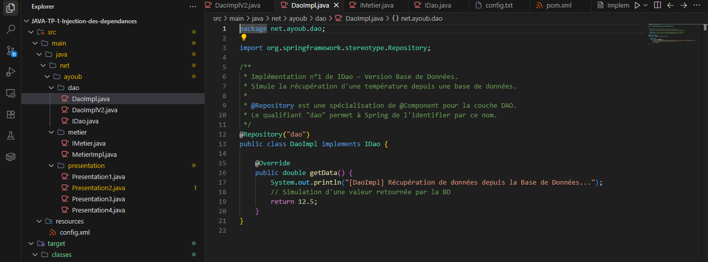
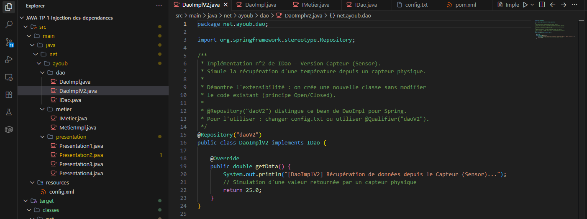
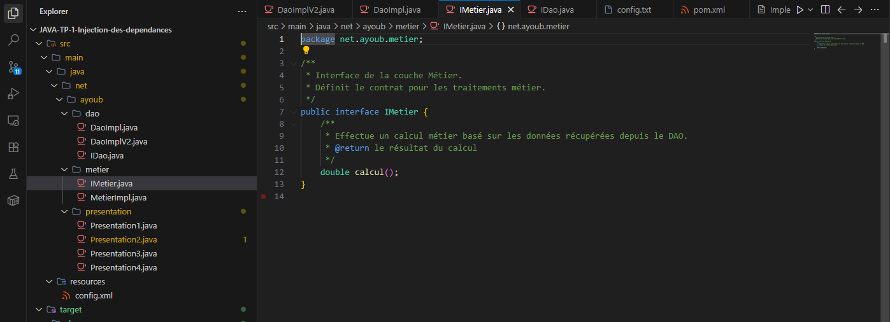
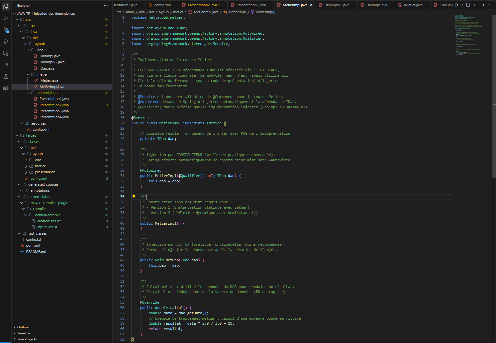
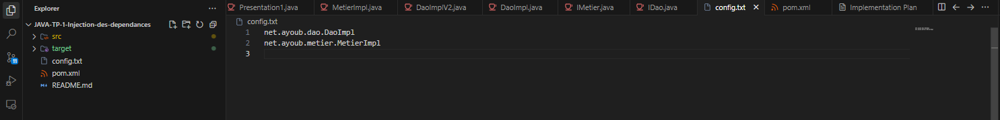
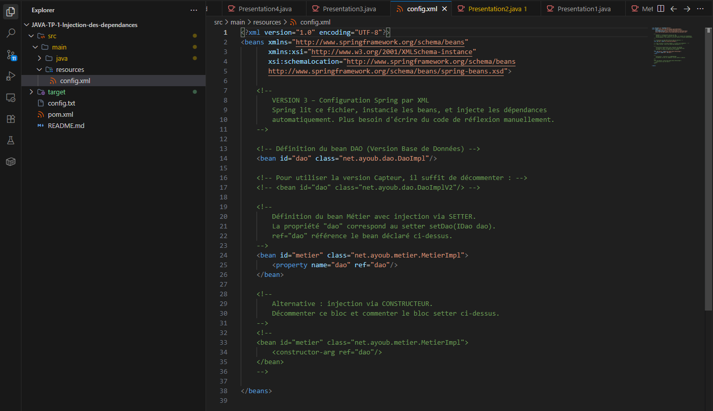

# TP1 – Inversion de Contrôle et Injection des Dépendances

> **Module :** Développement d'Applications d'Entreprise  
> **Réalisé par :** Ayoub ALOUANE  
> **Framework :** Spring 6 | **Langage :** Java 17 | **Build :** Maven

---

## 📌 Contexte et Objectifs

Ce TP a pour objectif d'implémenter le principe d'**Inversion de Contrôle (IoC)** et de l'**Injection de Dépendances (DI)** en Java, en passant progressivement par quatre approches :

1. Instanciation **statique** (couplage fort dans la présentation)
2. Instanciation **dynamique** par réflexion Java
3. Injection via le **Framework Spring – Configuration XML**
4. Injection via le **Framework Spring – Annotations**

---

## 🧠 Fondements Théoriques

### Inversion de Contrôle (IoC)
L'IoC est un patron de conception qui délègue au **framework** la responsabilité de créer les objets, de gérer leur cycle de vie et d'injecter leurs dépendances. Le développeur se concentre uniquement sur la **logique métier**.

### Principe Ouvert/Fermé (Open/Closed Principle)
> *« Une application doit être **fermée à la modification** mais **ouverte à l'extension**. »*

Pour respecter ce principe, on utilise le **couplage faible** : les classes dépendent d'**interfaces** et non d'implémentations concrètes.

### Couplage Faible vs Couplage Fort

| | Couplage Fort | Couplage Faible |
|---|---|---|
| **Dépendance** | Sur une classe concrète | Sur une interface |
| **Mot-clé** | `new ClasseConcrete()` | Injection par constructeur/setter |
| **Maintenabilité** | Faible | Élevée |
| **Extensibilité** | Difficile | Facile |

---

## 🏗️ Architecture du Projet

L'application est découpée en **trois couches** selon le patron MVC :

```
┌──────────────────────────────────────────┐
│            COUCHE PRÉSENTATION           │
│  Presentation1 / 2 / 3 / 4              │
│  (Point d'entrée, injection des beans)   │
└────────────────────┬─────────────────────┘
                     │ utilise
┌────────────────────▼─────────────────────┐
│             COUCHE MÉTIER                │
│  IMetier (interface)                     │
│  MetierImpl (implémentation)             │
│  → dépend de IDao (couplage faible)      │
└────────────────────┬─────────────────────┘
                     │ utilise
┌────────────────────▼─────────────────────┐
│              COUCHE DAO                  │
│  IDao (interface)                        │
│  DaoImpl     → version Base de Données   │
│  DaoImplV2   → version Capteur (Sensor)  │
└──────────────────────────────────────────┘
```

### Structure du projet


### Dépendances Maven (`pom.xml`)



---

## 📐 Diagramme de Classes

```
        «interface»                  «interface»
          IDao                         IMetier
        ─────────                    ─────────────
        + getData(): double           + calcul(): double
             ▲                              ▲
    ┌────────┴─────────┐                    │
    │                  │             ───────────────
DaoImpl           DaoImplV2         MetierImpl
────────          ──────────        ─────────────────────
getData()         getData()         - dao : IDao  ← couplage faible
(BD: 12.5)        (Capteur: 25.0)   + MetierImpl(IDao)
                                    + setDao(IDao)
                                    + calcul(): double
```

---

## 🔧 Détail des Implémentations

### Interface `IDao`
Définit le contrat de la couche DAO. Toute source de données (BD, capteur, web service…) doit implémenter cette interface.



```java
public interface IDao {
    double getData();
}
```

---

### `DaoImpl` – Version Base de Données
Simule la récupération d'une température depuis une base de données. Annotée `@Repository("dao")` pour Spring.



```java
@Repository("dao")
public class DaoImpl implements IDao {
    public double getData() {
        return 12.5; // valeur simulée depuis la BD
    }
}
```

---

### `DaoImplV2` – Version Capteur
Illustre le **principe Open/Closed** : on crée une nouvelle classe sans toucher au code existant. Annotée `@Repository("daoV2")`.



```java
@Repository("daoV2")
public class DaoImplV2 implements IDao {
    public double getData() {
        return 25.0; // valeur simulée depuis un capteur physique
    }
}
```

---

### Interface `IMetier`
Définit le contrat de la couche métier.



```java
public interface IMetier {
    double calcul();
}
```

---

### `MetierImpl` – Couplage Faible ⭐
L'attribut `dao` est de type **IDao (interface)** et n'est **jamais initialisé avec `new`**. C'est le cœur du couplage faible.



```java
@Service
public class MetierImpl implements IMetier {

    private IDao dao; // ← dépendance sur l'INTERFACE, pas la classe concrète

    // Injection par CONSTRUCTEUR (meilleure pratique)
    @Autowired
    public MetierImpl(@Qualifier("dao") IDao dao) {
        this.dao = dao;
    }

    // Constructeur sans argument (requis pour Versions 1 et 2)
    public MetierImpl() {}

    // Injection par SETTER
    public void setDao(IDao dao) { this.dao = dao; }

    @Override
    public double calcul() {
        double data = dao.getData();
        return data * 2.0 / 3.0 + 10; // traitement métier
    }
}
```

> ⚠️ **Attention** : Si on appelle `calcul()` sans avoir injecté `dao`, Java lance une `NullPointerException` car `dao` vaut `null` par défaut.

---

## 🚀 Les 4 Versions d'Injection

---

### ✅ Version 1 – Instanciation Statique

Le développeur utilise manuellement `new` dans la couche Présentation.

```java
// Injection par Setter
IDao dao = new DaoImpl();
MetierImpl metier = new MetierImpl();
metier.setDao(dao);
System.out.println(metier.calcul());

// Injection par Constructeur
IDao dao2 = new DaoImpl();
IMetier metier2 = new MetierImpl(dao2);
System.out.println(metier2.calcul());
```

**Résultat d'exécution :**


**Problème** : Si le client demande la version Capteur (`DaoImplV2`), il faut :
1. Modifier le code source (`new DaoImpl()` → `new DaoImplV2()`)
2. **Recompiler** l'application → violation du principe Open/Closed

---

### ✅ Version 2 – Instanciation Dynamique (Réflexion Java)

Les noms des classes sont lus depuis un fichier texte (`config.txt`). Le mot-clé `new` **n'est plus utilisé**.

**`config.txt`** :



**Mécanisme** :
```java
Class<?> cDao = Class.forName("net.ayoub.dao.DaoImpl");
IDao dao = (IDao) cDao.getDeclaredConstructor().newInstance();

Class<?> cMetier = Class.forName("net.ayoub.metier.MetierImpl");
IMetier metier = (IMetier) cMetier.getConstructor(IDao.class).newInstance(dao);
```

**Résultat d'exécution :**


**Avantage** : Pour passer à la version Capteur, on **modifie uniquement `config.txt`** — aucune recompilation.

| Exception possible | Cause |
|---|---|
| `ClassNotFoundException` | Nom de classe mal orthographié dans `config.txt` |
| `InstantiationException` | Classe abstraite ou sans constructeur public |
| `IllegalAccessException` | Constructeur privé |

**Inconvénient** : Ce code de réflexion est lourd et répétitif → c'est exactement ce que Spring résout.

---

### ✅ Version 3 – Spring Framework (Configuration XML)

Spring fait **tout le travail de réflexion automatiquement** d'après le fichier `config.xml`.

**`config.xml`** :



```xml
<bean id="dao" class="net.ayoub.dao.DaoImpl"/>

<bean id="metier" class="net.ayoub.metier.MetierImpl">
    <property name="dao" ref="dao"/>   <!-- injection par setter -->
</bean>
```

**Résultat d'exécution :**


**Avantage** : Pour changer d'implémentation, on modifie uniquement `config.xml` → aucune recompilation.

---

### ✅ Version 4 – Spring Framework (Annotations)

Le fichier XML est **totalement supprimé**. Les annotations remplacent la configuration.

| Annotation | Rôle |
|---|---|
| `@Repository` | Spécialisation de `@Component` pour la couche DAO |
| `@Service` | Spécialisation de `@Component` pour la couche Métier |
| `@Controller` | Spécialisation de `@Component` pour la couche Web |
| `@Autowired` | Injection automatique de la dépendance par Spring |
| `@Qualifier("dao")` | Précise quelle implémentation injecter (évite l'ambiguïté) |

**Problème de l'ambiguïté** : Si `DaoImpl` ET `DaoImplV2` sont toutes les deux annotées `@Repository`, Spring ne sait pas quelle implémentation choisir → **`UnsatisfiedDependencyException`**.  
**Solution** : `@Qualifier("dao")` dans le constructeur de `MetierImpl`.

**Résultat d'exécution :**


---

## 📊 Tableau Comparatif des 4 Versions

| Critère | Version 1 | Version 2 | Version 3 | Version 4 |
|---|---|---|---|---|
| **Technique** | `new` manuel | Réflexion Java | Spring XML | Spring Annotations |
| **Fichier de config** | Aucun | `config.txt` | `config.xml` | Annotations dans le code |
| **Recompilation si changement** | ✅ Oui | ❌ Non | ❌ Non | ❌ Non |
| **Couche Présentation fermée** | ❌ Non | ✅ Oui | ✅ Oui | ✅ Oui |
| **Complexité du code** | Faible | Élevée | Moyenne | Faible |
| **Pratique professionnelle** | Non recommandée | Non recommandée | Ancienne pratique | ✅ Recommandée |

---

## ▶️ Exécution du Projet

### Prérequis
- Java 17 (JDK)
- Apache Maven 3.x

### Compilation
```bash
mvn compile
```

### Exécution de chaque version

```bash
# Version 1 – Instanciation Statique
mvn exec:java -Dexec.mainClass="net.ayoub.presentation.Presentation1"

# Version 2 – Réflexion Dynamique
mvn exec:java -Dexec.mainClass="net.ayoub.presentation.Presentation2"

# Version 3 – Spring XML
mvn exec:java -Dexec.mainClass="net.ayoub.presentation.Presentation3"

# Version 4 – Spring Annotations
mvn exec:java -Dexec.mainClass="net.ayoub.presentation.Presentation4"
```

> **Note PowerShell** : Mettre les arguments entre guillemets :
> ```powershell
> mvn "exec:java" "-Dexec.mainClass=net.ayoub.presentation.Presentation1"
> ```

### Résultat attendu (toutes les versions)
```
[DaoImpl] Récupération de données depuis la Base de Données...
Résultat : 18.333333333333336
```

---

## 🔄 Passer à la Version Capteur (DaoImplV2)

| Version | Modification à effectuer | Recompilation ? |
|---|---|---|
| **V1** | Changer `new DaoImpl()` → `new DaoImplV2()` | ✅ Oui |
| **V2** | `config.txt` ligne 1 : `net.ayoub.dao.DaoImplV2` | ❌ Non |
| **V3** | `config.xml` : `class="net.ayoub.dao.DaoImplV2"` | ❌ Non |
| **V4** | `@Qualifier("daoV2")` dans `MetierImpl` | ✅ Oui (recompile MetierImpl) |

---

## 💡 Concepts Clés à Retenir

- **Couplage faible** = dépendre d'une **interface**, jamais d'une classe concrète
- **Injection de dépendance** = fournir à un objet ses dépendances de l'extérieur (pas de `new` dans la couche métier)
- **Injection par constructeur** = meilleure pratique (dépendance fournie à la création, objet toujours valide)
- **Injection par setter** = dépendance fournie après la création (objet temporairement invalide si `calcul()` est appelé avant)
- **Spring** automatise entièrement ce travail grâce à son conteneur IoC
